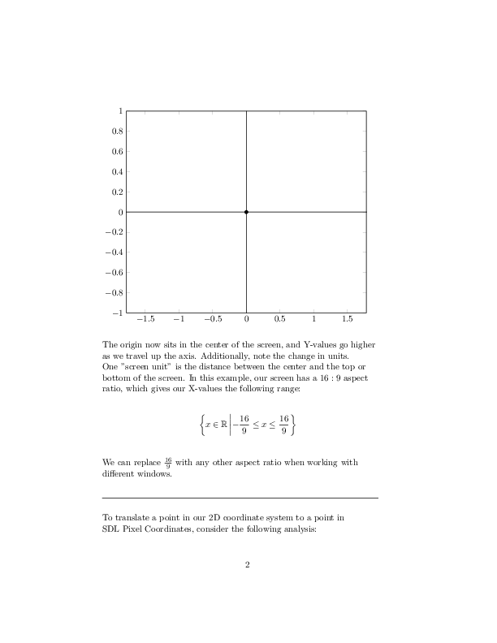
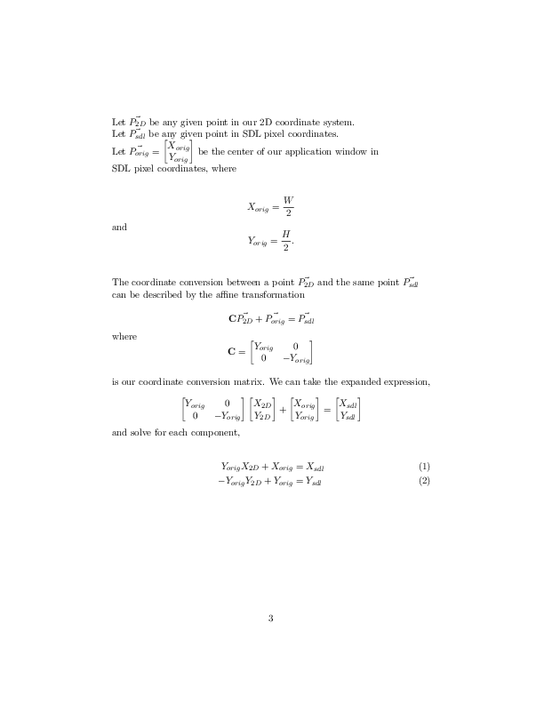
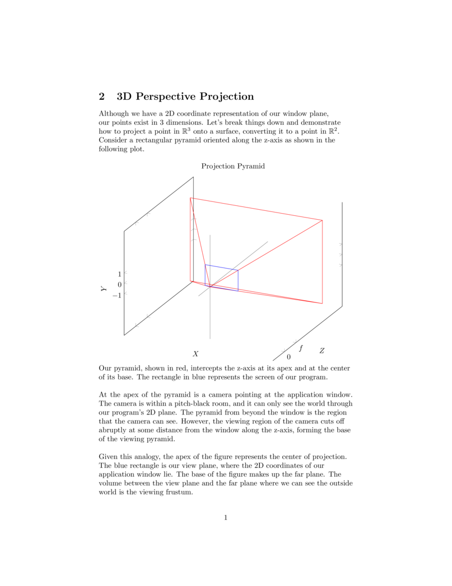
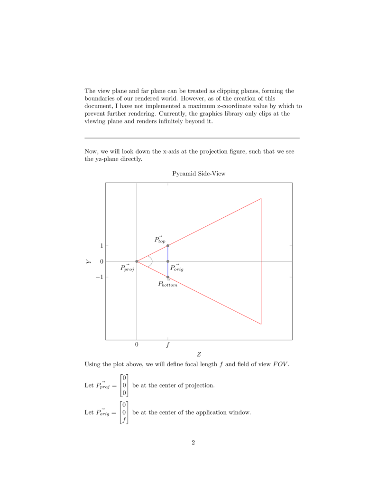
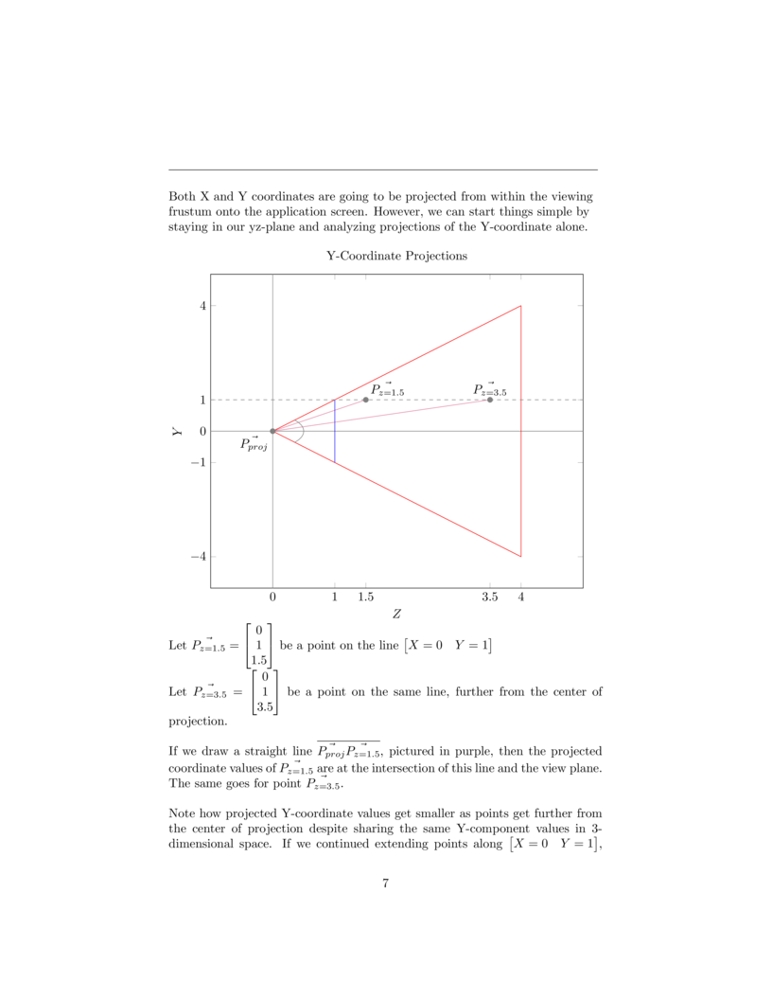
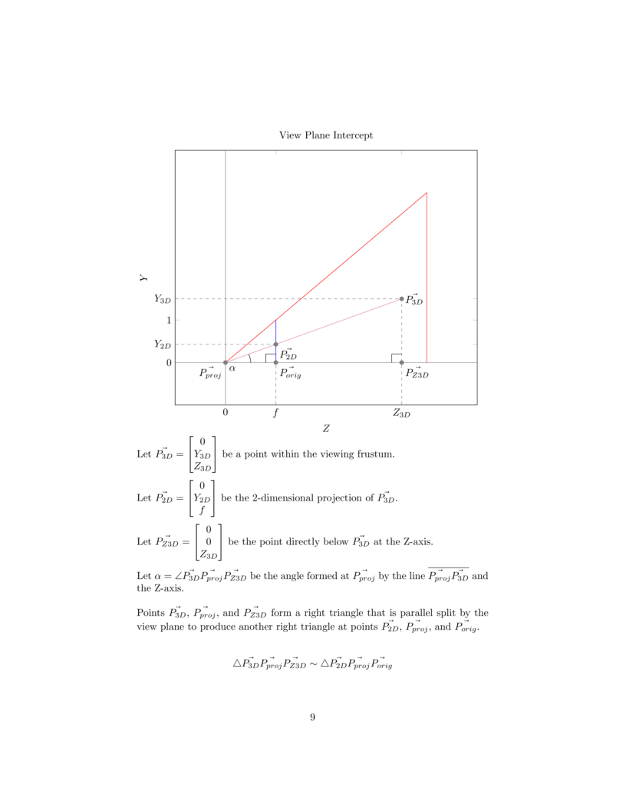
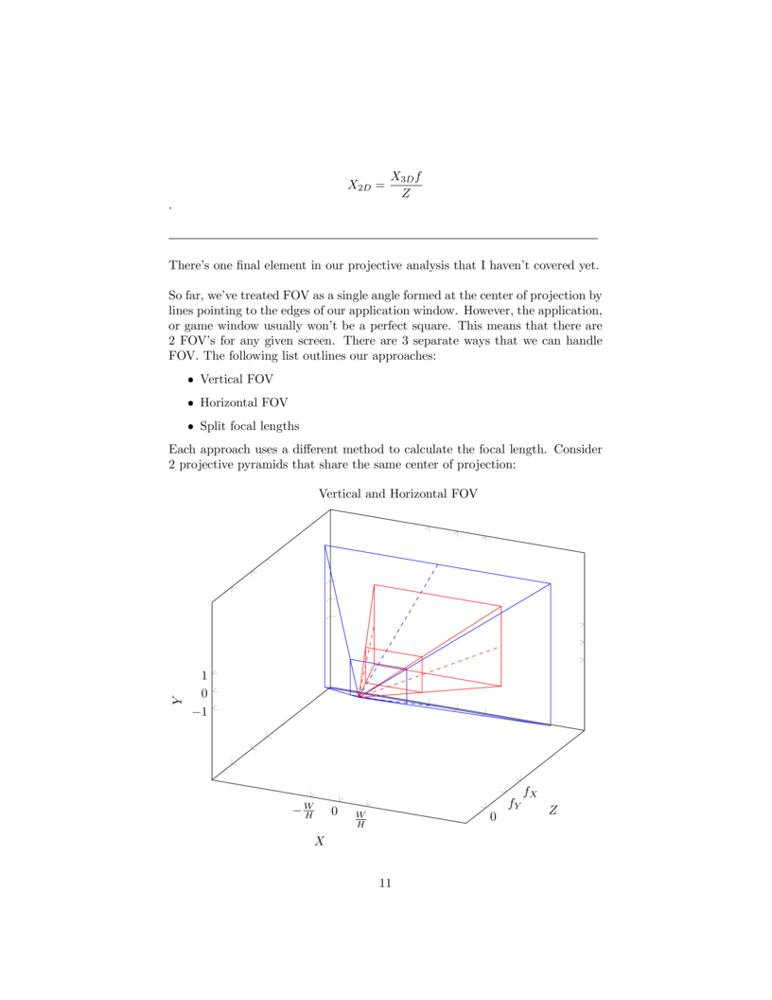
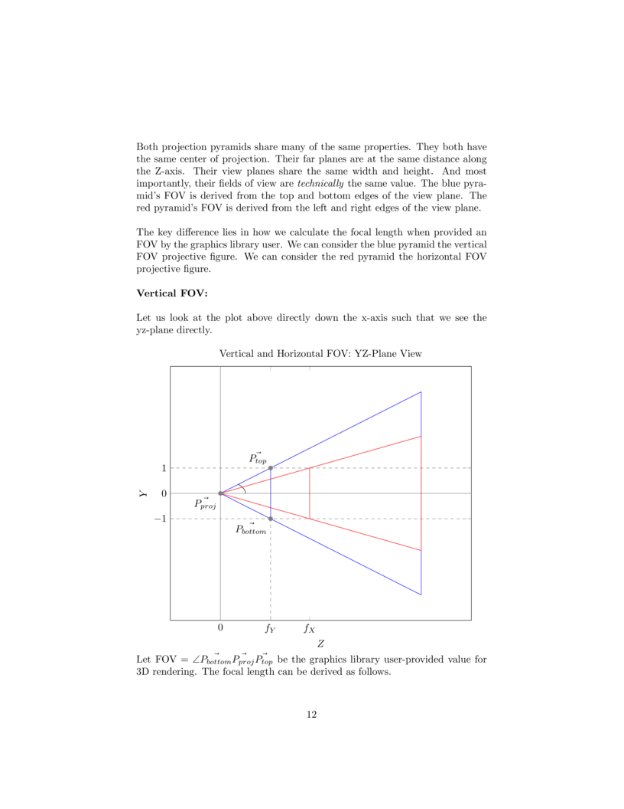
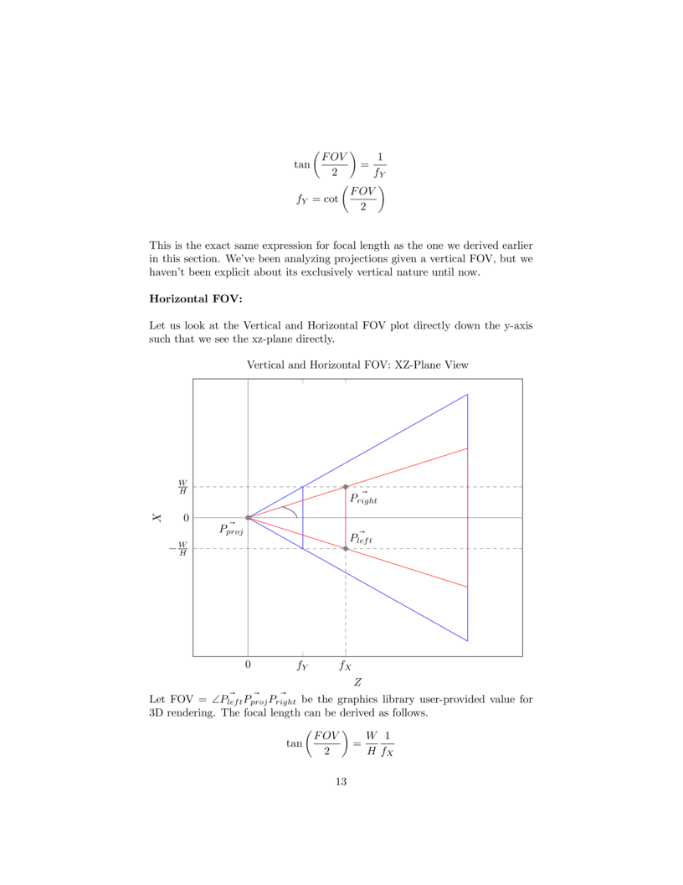
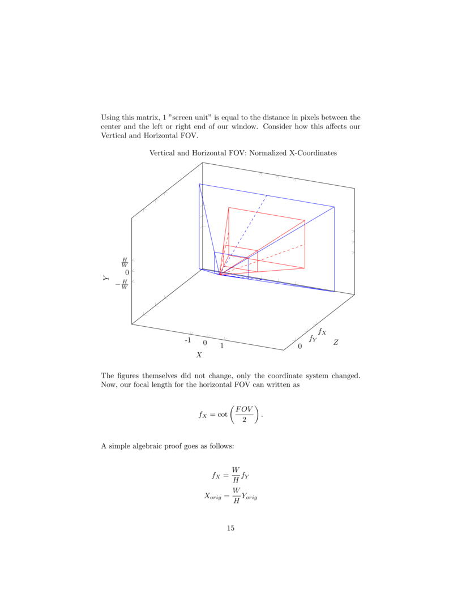

# ENV

**Video Demo**
[](https://www.youtube.com/embed/7CBShU7JFmg)

**Rudimentary 3d rendering and movement library built in SDL3**

I've been interested in building 3-dimensional worlds, using C, for people to fly around 
and explore in. I decided to go with a relatively simple library: SDL3. However, SDL3 does
not support 3d rendering natively without importing a GPU abstraction layer.

Thus, I am stuck with 3 options:

1. Use the native `SDL_GPU` API
2. Manage an OpenGL or Vulkan context within SDL3
3. Implement a 3d translation layer from scratch

I went with option 3. There's more to learn from by calculating the 3d-projections and 
linear matrix transformations directly. Granted - I admit in full sincerity - the hardware
API can probably perform these things far more efficiently.

## Dependencies

* A C compiler
* SDL3

## Usage

Link your own file(s) with `env.c`, `pnt.c`, the `SDL3` library and the `math` library
when compiling your program. An example build, using `cube_dimension.c` as our entry 
point, is compiled using the command outlined in this repository's `Makefile`:

```
cc cube_dimension.c env.c pnt.c -lSDL3 -lm -o cube_dimension
```
A set of currently-available functions can be found in `env.h`. Make sure that these
function prototypes, as well as the associated opaque struct, are included in your own
file(s). We can accomplish this at the preprocessing stage.

```
#include "env.h"
```
A simple breakdown of how to setup and build your environment goes as follows:

* Create an instance of your environment using `initEnv()`, which takes in six
  arguments:
    1. A pointer to a null-terminated character array to be used as your window title.
       Keep in mind, string literals are implicitly null-terminated.
    2. The width of your window in pixels
    3. The height of your window in pixels
    4. The Field of View in units of TAU radians, that is, in units of 2 * PI radians
       (For instance, 90 degrees = 0.25 TAU radians)
    5. The amount of space translated along the z-axis during each cycle of forward
       movement in the poll/render loop in units of the distance between the center of 
       your window and the top or bottom edge of your window (going forward, I will
       refer to these units as "screen units")
    6. The amount of space rotated along any given axis during each cycle of rotational
       movement in the poll/render loop in units of TAU radians
  
  Keyboard inputs for spacial translation and rotation can be accessed and modified in
  the `scanKeys()` function in `env.c`. The current mapping goes as follows:

  * 'F' is forward
  * 'D' is backward 
  * 'J' is pitch up
  * 'K' is pitch down
  * 'A' is yaw left
  * 'S' is yaw right
  * 'L' is roll left
  * ';' is roll right.

  The amount of space your step movements cover in your environment over a given period
  of time is tied to the frequency of your poll/render loop. As the amount of points in 
  your environment grows, the frequency of your loop slows because of the increased 
  amount of calculations done per render cycle. You can increase the size of your step 
  movements to account for longer render cycles.

* Destroy environment and free heap-allocated memory using `freeEnv()`. This must be done
  before your program ends

* Use `running()` as the condition for your poll/render loop to track when your program
  closes

* Call `pollEnv()` and `showEnv()` inside the poll/render loop.

* Use `addPoint()` to add a point to your 3D environment

* Use `addLine()` to add a line between two points to your 3D environment

* Use `addCube()` to add a cube to your environment

I built this library to be mutable and scalable because I plan to expand on it.
I suspect that anyone interested would want to do more than render a few points, 
lines or cubes. So, if you're interested in reading on, I'll explain the details of 
Env so that you can expand and modify it to your heart's content.

## Struct-Based Translation Units, Dynamic Memory, and Data Management

ENV, short for Environment, is the name of the struct that holds all the data used at the
core of the graphics library. This makes it easier to create functions that work on many
different areas of the application at once without having to pass a long list of 
arguments. 

The members of `Env`:

* The SDL window, rendering, and event contexts
* A boolean array to track key-presses 
* Another struct `pnt`, short for point, which holds the 3D point-position data
* Floating point step variables that define the speed of translational and angular
  movement
* A boolean variable used as a condition for the application's persistence in the main
  polling/rendering loop

Env and the data that it holds is heap-allocated at initialization. This allows the
rendering data to persist beyond the scope of initialization. I can pass an instance
of Env to another translation unit without placing the entire struct definition in 
`env.h`, preserving encapsulation.

The rest of `env.c` can work with SDL-specific functionality in `Env` and leave
the other translation units to do separate tasks.

Env uses a separate struct, `Pnt`, which is maintained in a separate translation unit,
`pnt.c`. Much line Env, Pnt is also heap-allocated and opaque to all other translation
units.

Pnt uses the standard `math` library to handle linear transformations and the
movement of points in 3-dimensional space. Pnt doesn't have any access to SDL, but it
maintains and calculates changes in a dynamic array of points whose values are passed 
back to `env.c` for rendering.

An instance of Pnt holds a pointer to an array of `Vec3` structs, each of which defines
a location in 3D space. Data is added to this array dynamically at runtime. The behavior
of `Pnt` is similar to that of `Vector` in C++. When size is at capacity and another
point is pushed in `pushPnt()`, capacity doubles.

At each cycle of the rendering loop, Pnt passes the value of each of its coordinates
to Env, which is then passed to `SDL_RenderPoint()` in `showEnv()`. Some functionality
is passed directly through Env to Pnt such as in `addPoint()` and `addLine()`. Other
functionality is only passed to Env, such as the keypress handling in the private
function `scanKeys()`.

In order to go in depth about the Pnt struct and the dance of data between Pnt and Env,
I need to cover the mathematics behind 3d rendering. The next few sections will give us
a full understanding of how the library works.

## Coordinate Conversions

`showEnv()` iterates over the coordinate data of every point in `Pnt` using `getX()` and
`getY()`. Each coordinate is placed in `SDL_RenderPoint()`. However, the way that we
place coordinates and the way that Pnt uses coordinates is not the same way that SDL
uses coordinates. Consider the following planes that represent the window screen:





The return statement lines of `getX()` and `getY()` implement the component-form 
solutions X_sdl and Y_sdl, respectively.

```
return pnt->yorig * x_2D + pnt->xorig;
```
```
return -pnt->yorig * y_2D + pnt->yorig;
```

The window-center pixel coordinates are calculated during `Pnt` initialization in
`initPnt()`.

```
pnt->xorig = xlen / 2;
pnt->yorig = ylen / 2;
```

## 3D Perspective Projection

`Pnt` holds a dynamic array of `Vec3` structs. The pointer to the first element in our
array is struct member `p`. Each instance of `Vec3` describes the location of a point
in $\mathbb{R}^3$ using its members `x`, `y`, and `z`. 

Therefore, before we can convert 2D coordinates into pixel coordinates, we need to
map the 3D coordinates of our `Vec3` array onto our 2D application window.
















This library implements an exclusively vertical FOV by normalizing the Y-coordinate
component and calculating the focal length as $\cot\left( \frac{FOV}{2} \right)$. The
FOV is taken in units of TAU radians as a parameter in `initEnv()`, which is passed
directly to `initPnt()` as an argument, where the focal length is calculated.

```
pnt->zfl = 1.0 / tan(FOV * TAU / 2);
```
`Pnt` stores the value of the focal length in its struct member `zfl`. A pointer to
an instance of `Pnt` is passed to `getX()` and `getY()` using the argument `Pnt *pnt`.
Both functions make use of `pnt->zfl` to determine if a `Vec3` position is behind the
view plane. If so, the coordinate component value is assigned well beyond the screen
boundary.

```
if ((pnt->p + ind)->z < pnt->zfl) {
    return 1e4; 
}
```
If the location of a point is in front of the view plane, the 3-dimensional coordinates
are projected onto the 2-dimensional plane using the focal length.

```
float x_2D = (pnt->p + ind)->x * pnt->zfl / (pnt->p + ind)->z;
```
```
float y_2D = (pnt->p + ind)->y * pnt->zfl / (pnt->p + ind)->z;
```
## Translations and Rotations

With coordinate conversion and 3D perspective projection out of the way, we are 
free to place and move points in our 3D environment however we wish. The rest of
the library will handle how those points are rendered.

How do we move our center of projection around an array of 3D coordinates that describe
points, lines, and geometric solids? This is a trick question. We don't move our center
of projection at all. Instead, we move all of the points in our environment around the 
center of projection.

Examine the table below.


The step values for 3D translation and rotation are passed into `initEnv()` as 
`unitStep` and `tauStep`, respectively. `initEnv()` creates an instance of `Env` and
stores these values as struct members.

```
env->unitStep = unitStep;
env->tauStep  = tauStep;
```
During program runtime, `pollEnv()` checks the program state and polls for keypresses
by calling the private function `scanKeys()`. Keys are mapped to 3D transformations
that apply to all points in the environment.

```
if (*(env->keys + SDL_SCANCODE_F)) { /* forward */
        ztrans(env->pnt, -env->unitStep);
}
if (*(env->keys + SDL_SCANCODE_D)) { /* backward */
        ztrans(env->pnt, env->unitStep);
}
if (*(env->keys + SDL_SCANCODE_J)) { /* pitch up */
        xrot(env->pnt, env->tauStep);
}
if (*(env->keys + SDL_SCANCODE_K)) { /* pitch down */
        xrot(env->pnt, -env->tauStep);
}
if (*(env->keys + SDL_SCANCODE_A)) { /* yaw left */
        yrot(env->pnt, env->tauStep);
}
if (*(env->keys + SDL_SCANCODE_S)) { /* yaw right */
        yrot(env->pnt, -env->tauStep);
}
if (*(env->keys + SDL_SCANCODE_L)) { /* roll left */
        zrot(env->pnt, -env->tauStep);
}
if (*(env->keys + SDL_SCANCODE_SEMICOLON)) { /* roll right */
        zrot(env->pnt, env->tauStep);
}
```
Transformation functions are defined in `pnt.c`. All transformations make use of
the step values stored in our `Env` struct instance.

The z-translation function `ztrans()` shifts the z-coordinate value of every point
in `Pnt`.

```
void ztrans(Pnt *pnt, float dz)
{
        for (int i = 0; i < pnt->size; i++) {
                (pnt->p + i)->z += dz;
        }
}
```
The rotation functions shift all coordinate values with respect to the matricies
$\mathbf{R_x}(\theta)$, $\mathbf{R_y}(\theta)$, and $\mathbf{R_z}(\theta)$.

```
void xrot(Pnt *pnt, float dtau)
{
        for (int i = 0; i < pnt->size; i++) {
                (pnt->p + i)->y = (pnt->p + i)->y * cos(dtau*TAU) -
                                  (pnt->p + i)->z * sin(dtau*TAU);

                (pnt->p + i)->z = (pnt->p + i)->y * sin(dtau*TAU) +
                                  (pnt->p + i)->z * cos(dtau*TAU);
        }
}
void yrot(Pnt *pnt, float dtau)
{
        for (int i = 0; i < pnt->size; i++) {
                (pnt->p + i)->x = (pnt->p + i)->x * cos(dtau*TAU) +
                                  (pnt->p + i)->z * sin(dtau*TAU);

                (pnt->p + i)->z = (pnt->p + i)->x * -sin(dtau*TAU) +
                                  (pnt->p + i)->z *  cos(dtau*TAU);
        }
}
void zrot(Pnt *pnt, float dtau)
{
        for (int i = 0; i < pnt->size; i++) {
                (pnt->p + i)->x = (pnt->p + i)->x * cos(dtau*TAU) -
                                  (pnt->p + i)->y * sin(dtau*TAU);

                (pnt->p + i)->y = (pnt->p + i)->x * sin(dtau*TAU) +
                                  (pnt->p + i)->y * cos(dtau*TAU);
        }
}
```
## Line Interpolation

There are 2 ways that we can go about creating lines in SDL.
1. Use `SDL_RenderLine()`
2. Place points along a path using `SDL_RenderPoint()`

If I went with the first option, I would have stored render data as pairs 
of coordinates instead of single point coordinates. I choose the second option 
because it leaves the user with flexibility to render individual points or
create curved-line functions.

`pushPnt()` in `pnt.c` dynamically adds the coordinate values of a point location 
to the end of the `Vec3` array in our instance of `Pnt`. `env.c` gives the user
direct access to `pushPnt()` via the function `addPoint()`.

```
void pushPnt(Pnt *pnt, float x, float y, float z)
{
        if (pnt->size == pnt->capacity) {
                pnt->p = realloc(pnt->p, 2 * pnt->capacity * sizeof(Vec3));
                pnt->capacity *= 2;
        }
        (pnt->p + pnt->size)->x = x;
        (pnt->p + pnt->size)->y = y;
        (pnt->p + pnt->size)->z = z;
        (pnt->size)++;
}
```
`pushLne()` in `pnt.c` builds off the function `pushPnt()`. First, `pushLne()`
calculates the distance in pixels between 2 point coordinates.

```
float dx = x1 - x0;
float dy = y1 - y0;
float dz = z1 - z0;

float length = sqrt(dx*dx + dy*dy + dz*dz);
float pixlen = length * pnt->yorig;
```
Then the pixel length is used to create step values for each component that
define the displacement between each individual point.

```
float xstep = dx / pixlen;
float ystep = dy / pixlen;
float zstep = dz / pixlen;

for (float i = 0; i < pixlen; i++) {

        pushPnt(pnt, x0, y0, z0);
        x0 += xstep;
        y0 += ystep;
        z0 += zstep;
}
```
The step values shown above ensure that points forming a line are close enough
together to prevent visual separation as the line approaches the view plane. `env.c`
gives the user direct access to `pushLne()` via the function `addLine()`.

The function `addCube()` in `env.c` builds off the function `pushLne()` to draw out
a cube. The user provides a coordinate location and the side length. The cube's 
front-bottom-left vertex is placed at the user-specified position.

```
void addCube(Env *env, float x, float y, float z, float len)
{
        /* front face */
        pushLne(env->pnt, x    , y    , z, x+len, y    , z);
        pushLne(env->pnt, x+len, y    , z, x+len, y+len, z);
        pushLne(env->pnt, x+len, y+len, z, x    , y+len, z);
        pushLne(env->pnt, x    , y+len, z, x    , y    , z);

        /* back face */
        pushLne(env->pnt, x    , y    , z+len, x+len, y    , z+len);
        pushLne(env->pnt, x+len, y    , z+len, x+len, y+len, z+len);
        pushLne(env->pnt, x+len, y+len, z+len, x    , y+len, z+len);
        pushLne(env->pnt, x    , y+len, z+len, x    , y    , z+len);

        /* connecting lines */
        pushLne(env->pnt, x    , y    , z, x    , y    , z+len);
        pushLne(env->pnt, x+len, y    , z, x+len, y    , z+len);
        pushLne(env->pnt, x+len, y+len, z, x+len, y+len, z+len);
        pushLne(env->pnt, x    , y+len, z, x    , y+len, z+len);
}
```
## Going Forward

* Implement a far clipping plane to prevent an infinite render distance, which can
  hamper performance in large environments
* Use homogeneous coordinates for conversion, projection, and 3D movement
* Render surfaces as triangles and implement surface occlusion
* Implement light sources and surface lighting
